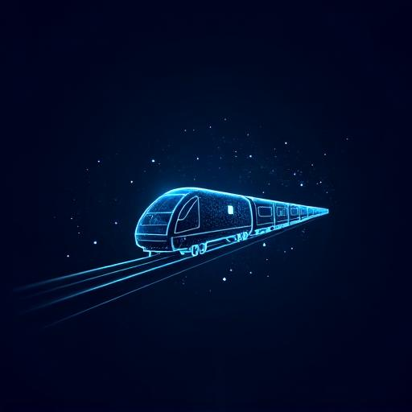

# RailAnukriti 🚂

**AI-Powered Smart Train Traffic Optimizer for Indian Railways**

RailAnukriti is an intelligent railway traffic control system that optimizes train precedence, crossings, and platform allocation using advanced AI techniques including Reinforcement Learning, OR-Tools, and Graph Neural Networks. The system provides real-time simulation, explainable AI recommendations, and human-in-the-loop control for section controllers.



## 🎯 Core Purpose

Assist section controllers with real-time, optimized decisions for train precedence and crossings to:
- Maximize section throughput
- Minimize train travel time
- Support rapid re-optimization during disruptions
- Provide clear AI recommendations with explanation and override capabilities

## ✨ Key Features

### Real-Time Operations
- **Live Train Tracking**: Real-time visualization of train positions on track sections
- **Interactive Map View**: Fullscreen Mapbox-powered map with train movement animations
- **Conflict Detection**: Automatic identification of train conflicts with severity indicators
- **Sound Notifications**: Audio alerts for critical events based on severity levels

### AI-Powered Intelligence
- **Smart Recommendations**: AI-generated suggestions for train precedence decisions
- **Delay Prediction**: Forecasts upcoming delays using machine learning analysis
- **Conflict Resolution**: AI-powered resolution suggestions for detected conflicts
- **Congestion Forecasting**: Predictive analytics for section congestion

### Analytics & Monitoring
- **KPI Dashboard**: Comprehensive metrics tracking across 5 categories
- **Performance Charts**: Historical trends with interactive visualizations
- **Schedule Gantt Chart**: Visual comparison of scheduled vs actual timings
- **Audit Logging**: Complete trail of all controller actions

### Simulation & Planning
- **Scenario Simulation**: What-if analysis for decision planning
- **Export Capabilities**: Data export for reports and analysis

## 🛠️ Technology Stack

- **Frontend**: React 18, TypeScript, Vite
- **Styling**: Tailwind CSS, shadcn/ui components
- **Animations**: Framer Motion
- **Charts**: Recharts
- **Maps**: Mapbox GL
- **Backend**: Supabase (Database, Auth, Edge Functions)
- **AI**: Lovable AI (Google Gemini integration)

## 🚀 Getting Started

### Prerequisites
- Node.js 18+ & npm

### Installation

```bash
# Clone the repository
git clone <YOUR_GIT_URL>

# Navigate to project directory
cd railanukriti

# Install dependencies
npm install

# Start development server
npm run dev
```

The application will be available at `http://localhost:5173`

## 📊 Dashboard Modules

| Module | Description |
|--------|-------------|
| **Overview** | Real-time section status with train positions and track occupancy |
| **Recommendations** | AI-powered suggestions for optimal train operations |
| **Conflicts** | Active conflict detection and resolution interface |
| **Predictions** | Delay forecasting and risk assessment |
| **Schedule** | Gantt chart visualization of train schedules |
| **Analytics** | Historical performance metrics and trends |
| **KPIs** | Key performance indicators across multiple categories |
| **Charts** | Detailed performance visualizations |
| **Simulation** | Scenario planning and what-if analysis |
| **Alerts** | System notifications and warnings |
| **Audit** | Complete log of controller actions |
| **Export** | Data export functionality |

## 🔐 Authentication

The system uses email/password authentication with user profiles including:
- Full name
- Role assignment
- Section assignment

## 🎨 Design System

RailAnukriti features a dark industrial aesthetic optimized for control room environments:
- **Primary**: Electric blue/cyan for AI-powered elements
- **Warning**: Amber for caution states
- **Success**: Green for clear status
- **Danger**: Red for conflicts and issues

## 📱 Responsive Design

The dashboard is fully responsive and optimized for:
- Desktop control room displays
- Tablet devices for mobile controllers
- Standard desktop browsers

## 🤝 Contributing

Contributions are welcome! Please feel free to submit issues and pull requests.

## 📄 License

This project is proprietary software developed for Indian Railways.

---

**Built with ❤️ using [Lovable](https://lovable.dev)**
